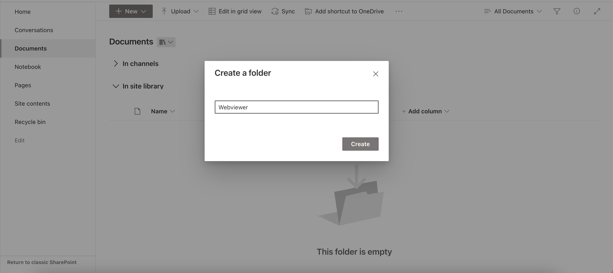
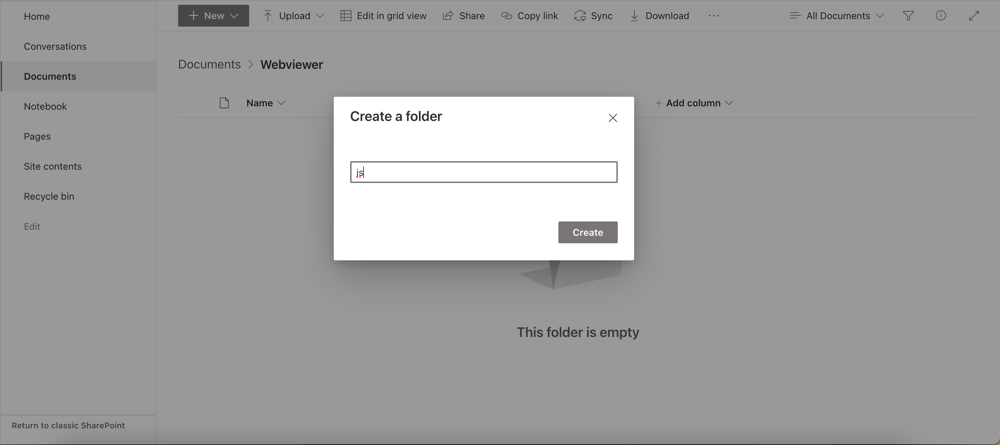
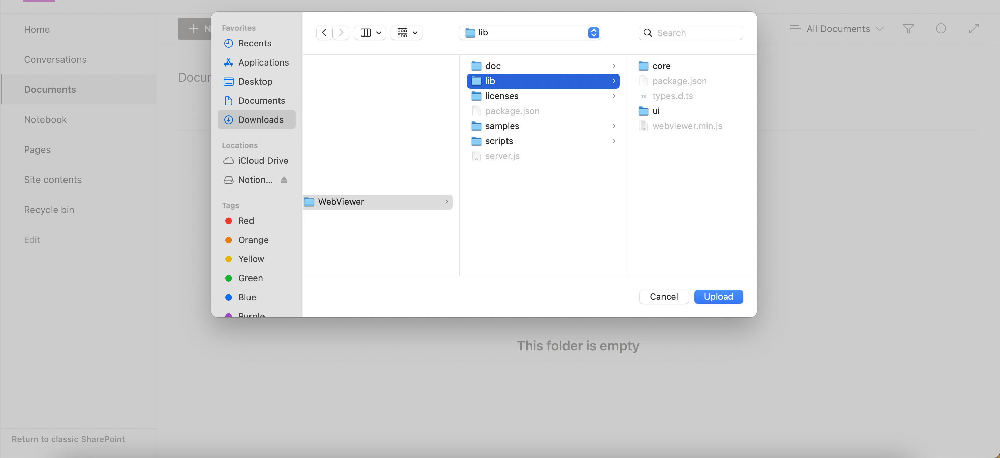
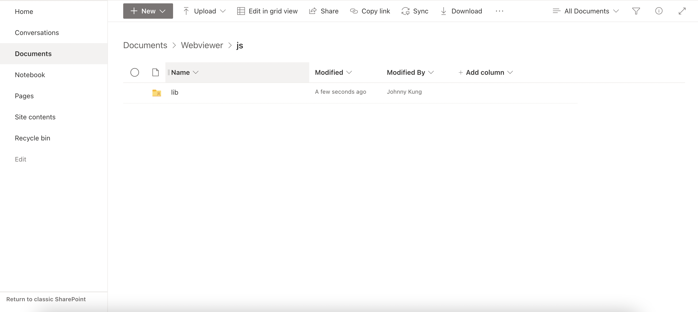

Prequisite:
1. Node.js version: 14.17.0
2. npm version: 6.14.13
# SharePoint-extension
- Create a `.env` file. Add two parameters: `SHAREPOINT_SITE_URL` and `SITE_PAGE` in the `.env` file.
`SHAREPOINT_SITE_URL` is your sharepoint site url, ex: https://{your-tenant-id}.sharepoint.com/sites/{site-name}
`SITE_PAGE` is your SharePoint page that has webviewer
- run `gulp serve` and enable debug script.

To deploy the extension to SharePoint, follow the steps below:
- use `gulp bundle --ship` to bundle the extension
- use `gulp package-solution --ship` to create the package file
Login to the SharePoint admin center, and navigate to __Manage Apss__ page, then upload the custom app (package file) and enable it.
In your SharePoint site, add the extension by clicking the setting button on top right and click "Add an app". Select the extension app you just enabled.
Go back to the document library, and it should show *Open in PDFTron* option when you right click a document.
After clicking, it will redirect to the page specified, whether it's page that contains webviewer web part or a static page with webviewer.

# SharePoint-web-part
## Set up webviewer assets url
To start developing SharePoint web part, we need to set up SharePoint Online Powershell (Windows) or PnP powershell (Mac).
**Windows**
Open powershell and use the following commands
1. Use `Connect-SPOService -Url https://{your-tenant-id}-admin.sharepoint.com`.
2. Then use `Set-SPOsite https://{your-tenant-id}/sites/{site-name} -DenyAddAndCustomizePages 0` to enable customize pages.

**Mac**
1. Install Pnp powershell: https://www.c-sharpcorner.com/article/how-to-run-pnp-powershell-in-macos/
2. After installation, use `pwsh` to enable powershell in the terminal.
3. Use `Connect-PnPOnlin -Url https://{your-tenant-id}-admin.sharepoint.com -Interactive` to login.
4. Use `Set-PnPSite -Identity https://{your-tenant-id}.sharepoint.com/sites/${site-name} -NoScriptSite $false` to enable custom script in SharePoint. This should allow custom script on our site.

Next, we'll need to upload the WebViewer static files to the Document Library in the SharePoint site.

Create a folder called "Webviewer" in the Document Library and create another folder called "js" inside the "Webviewer" folder.



Click into the "js" folder and upload the webviewer `lib` folder to the `js` folder.



Now, the webviewer lib folder should be available from the url: `https://<your-tenant-id>.sharepoint.com/sites/<site-name>/Shared Documents/Webviewer/js/lib`.

## Web part Development
Change the `"initialPage"` property in the `serve.json` file in the `config` folder with your tenant id and site name.

In the local `sharepoint-web-part` folder, we need to create a `.env` file and the following environment paramers are need in the `.env` file:
```
TENANT_ID=<your-tenant-id>
SITE_NAME=<site-name>
WEBVIEWER_LIB_FOLDER_PATH=<lib-folder-path>
```
The `WEBVIEWER_LIB_FOLDER_PATH` is a relative path. It's `/Webviewer/js/lib` in our project.

Run `npm i` to install all the packages needed.

Install gulp using `npm install --global gul-cli`.

After installation, use `gulp serve` to run the project. This will serve the web part in a workbench.

**Note**: 
If you couldn't run `gulp serve` because of permission issue, you chould use `gulp trust-dev-cert` to generate self-signed SSL certificate.

## Deploy the app
Before deploying the app, we need to bundle it and create a solution package.
- Use `gulp bundle --ship` to bundle the web part with static files.
- Use `gulp package-solution --ship` to create the solution package file.
- To deploy the app, log in as the sharepoint admin in __More features in the SharePoint admin center__. On the __Manage Apps__ page, upload the custom app and enable it.
- Then in the SharePoint site, add the custom app by clicking the setting button on top right and click "Add an app". Select the app you just uploaded.
- Create a page and add the web part to the page.